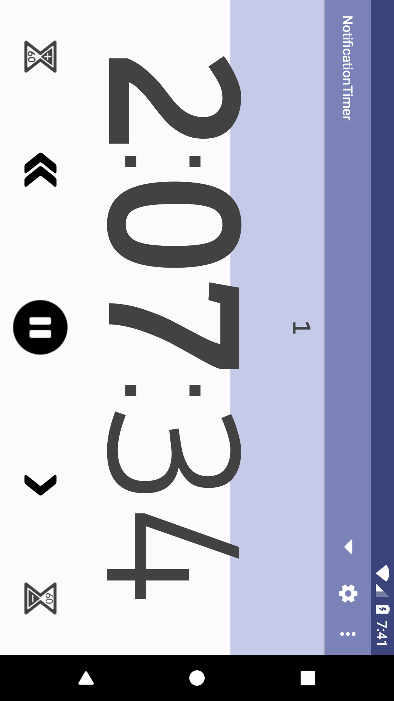

# NotificationTimer

Simple and clean countdown timer entirely controllable from the notifications and the lock screen.
Perfect for a quick access when unlocking the screen or while using another application, no need to expand the notification to access the buttons.

Customizable timeout notification from the settings: vibration, sound, light and color background.

Large display of the remaining time always adjusted to the width of the screen in the application, use the always screen on option to keep an eye on the remaining time.

Add an optional extra notification to get notified seconds before the end to get ready.

Save timer presets to easily switch between the timers you always use.

## Features

* Timer controls from the notification and the lock screen
* Quick preset timers selection
* Big numbers always fitting the screen
* Option to keep the screen on
* Timer number to track laps
* Multi-window support
* No permission required

## Download

https://play.google.com/store/apps/details?id=com.notification.timer

## Screenshots

### Notification

#### Android 5.0+

#### Android 7.0+

#### Android 8.0+
The background color can be customized or disabled from the settings. These colors match the progress bar background color of the activity.

### Activity

    

### Tutorial

     

## License

Copyright 2018 Guillaume Militello

Licensed under the Apache License, Version 2.0 (the "License");
you may not use this file except in compliance with the License.
You may obtain a copy of the License at

    http://www.apache.org/licenses/LICENSE-2.0

Unless required by applicable law or agreed to in writing, software
distributed under the License is distributed on an "AS IS" BASIS,
WITHOUT WARRANTIES OR CONDITIONS OF ANY KIND, either express or implied.
See the License for the specific language governing permissions and
limitations under the License.
