# NotificationTimer

Type in the time you want for the countdown timer, then control it from the notification without the need to expand it or use the always screen on option to keep an eye on the remaining time. 
When the time is out, a simple notification will occur. This notification is customizable from the settings: vibration, sound, light and color background (Android 8.0+). 
You can add an extra notification to get notified few seconds before the end to be prepared.

## Features

* Timer controls from the notification
* Quick preset timers selection
* Big numbers always fitting the screen
* Option to keep the screen on
* Timer number to track laps
* Multi-window support

## Download

https://play.google.com/store/apps/details?id=com.notification.timer

## Screenshots

### Notification

#### Android 5.0+

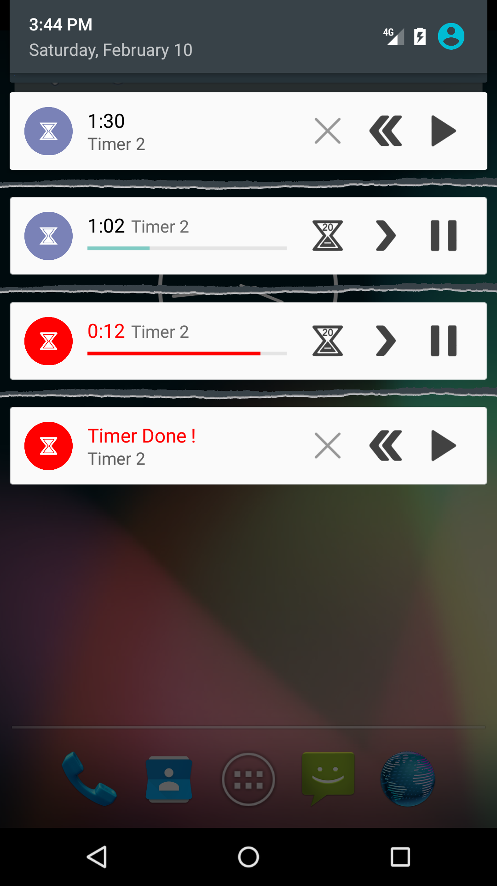

#### Android 7.0+

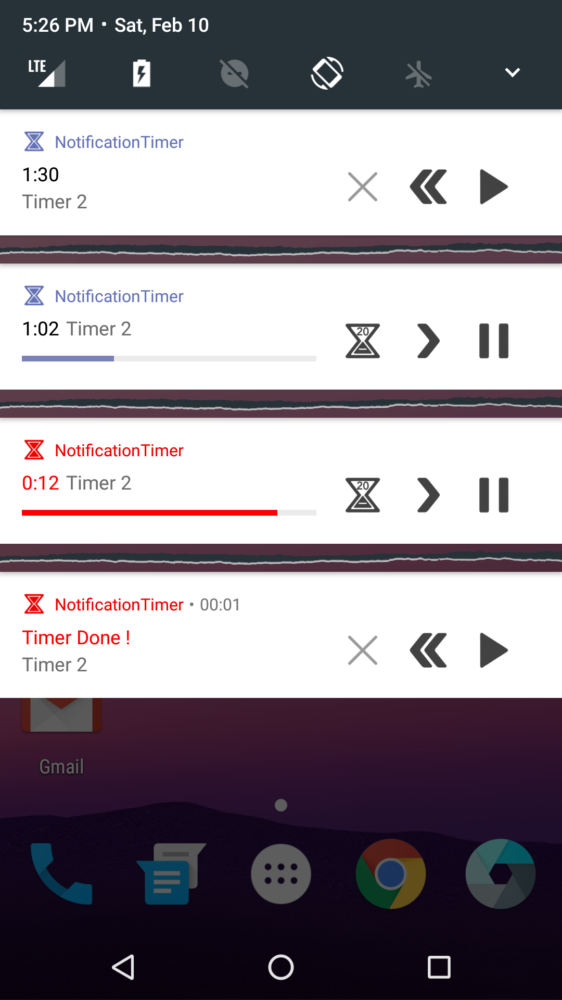

#### Android 8.0+
The background color can be customized or disabled from the settings. These colors match the progress bar background color of the activity.

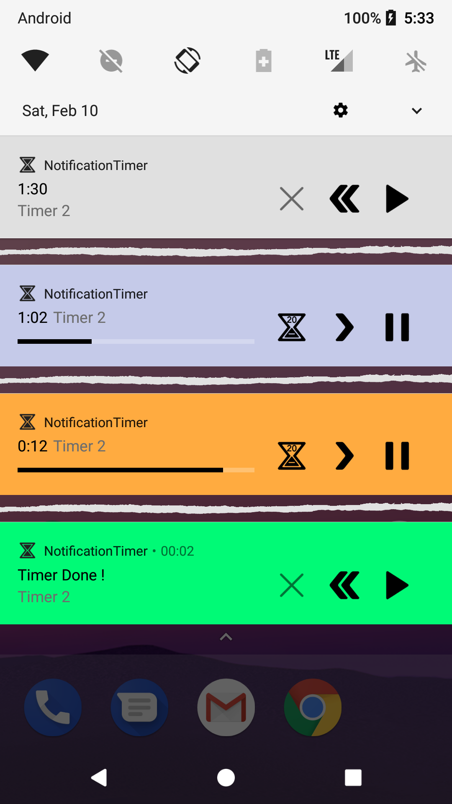

### Activity

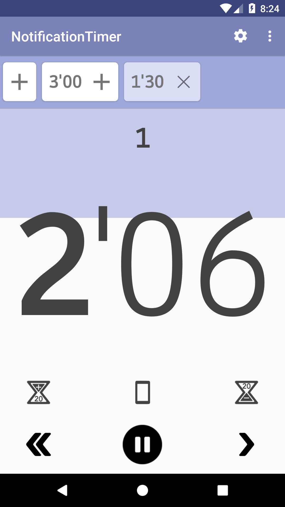 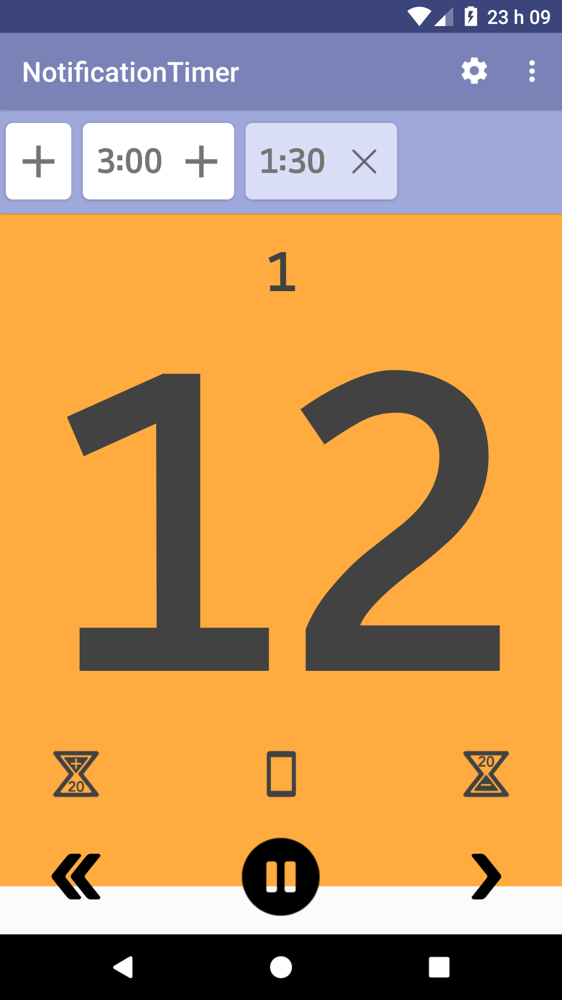 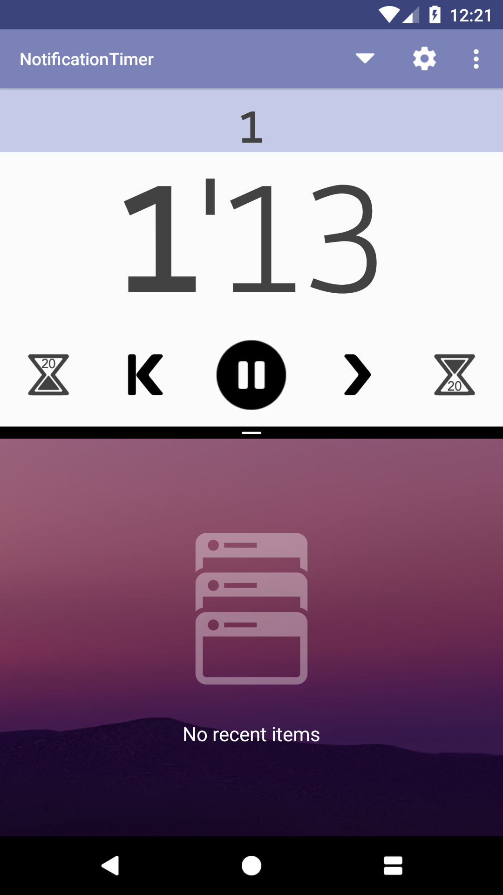 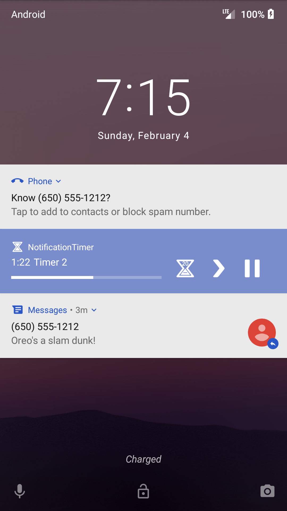

### Tutorial

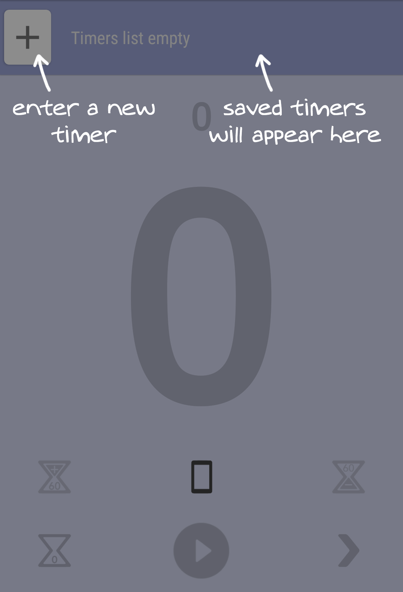 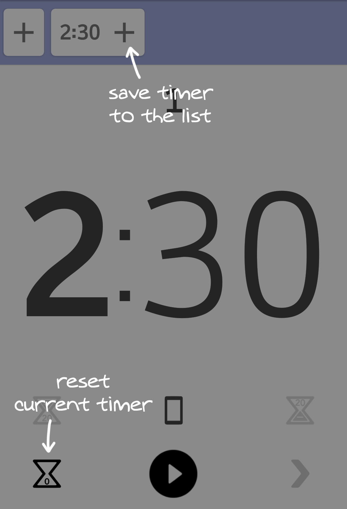 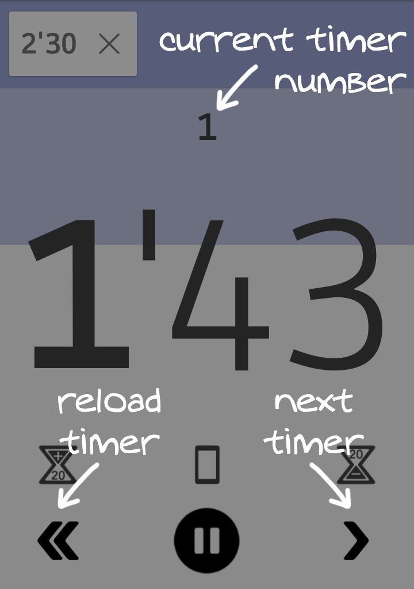 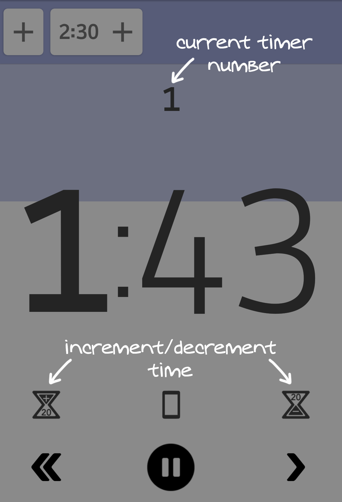 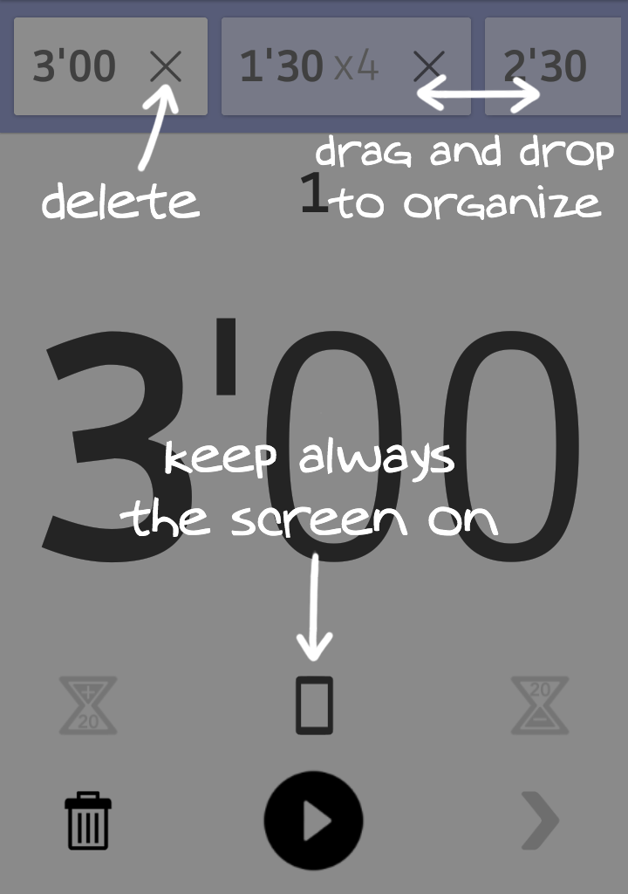 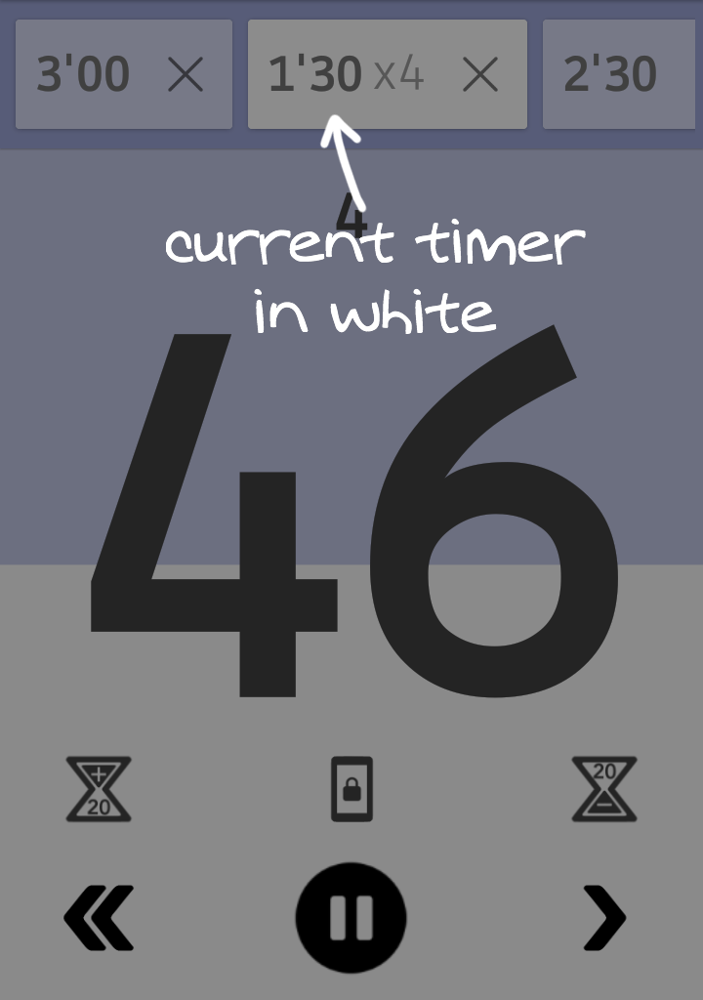

## License

Copyright 2018 Guillaume Militello

Licensed under the Apache License, Version 2.0 (the "License");
you may not use this file except in compliance with the License.
You may obtain a copy of the License at

    http://www.apache.org/licenses/LICENSE-2.0

Unless required by applicable law or agreed to in writing, software
distributed under the License is distributed on an "AS IS" BASIS,
WITHOUT WARRANTIES OR CONDITIONS OF ANY KIND, either express or implied.
See the License for the specific language governing permissions and
limitations under the License.
