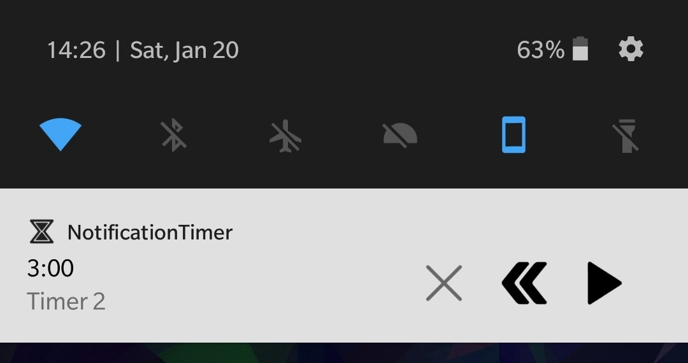
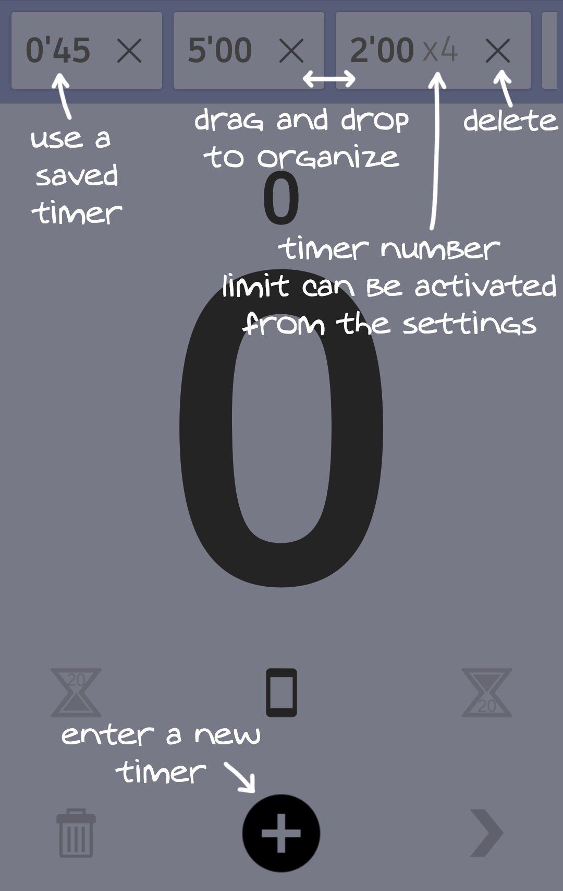
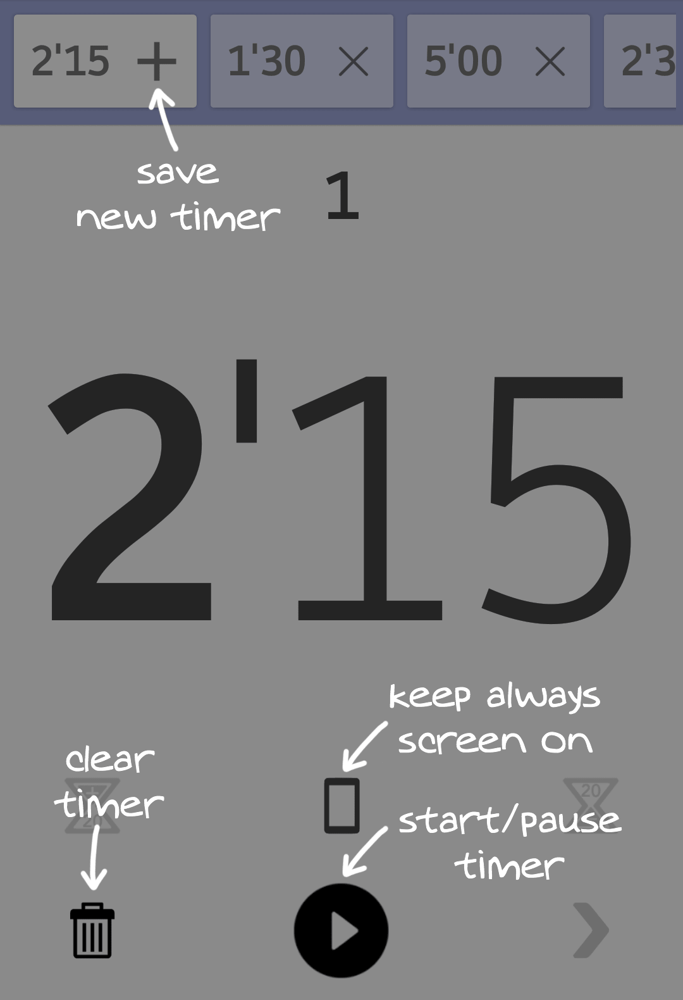
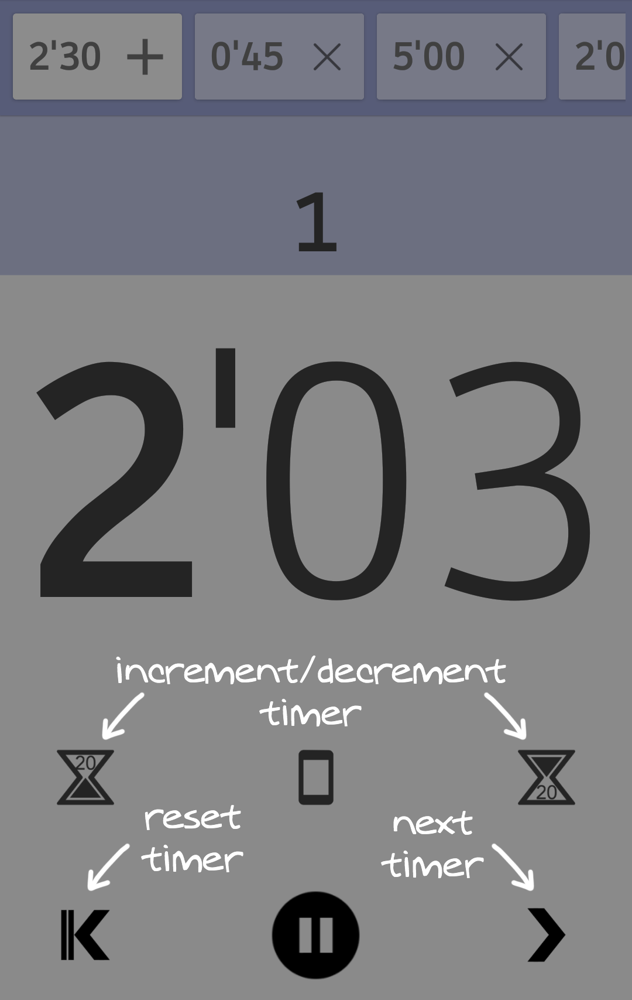

# NotificationTimer

Type in the time you want, control it from the notification without the need to expand it or use always screen on option to always keep an eye on the remaining time. 
Once the timer is done, a simple notification will occur. 
You can add an extra notification to get notified few seconds before the end to get ready.

## Features

* Timer controls from the notification
* Quick preset timer selection
* Big number display
* Always screen on
* Multi-window support
* Timer number to track laps
* Customizable background color progress bar
* Multi-windows support

## Downloads

[NotificationTimer.0.8.2.apk](release/NotificationTimer.0.8.2.apk)

## Screenshots

### Notification

#### Android 5.0+

  

#### Android 7.0+

  

#### Android 8.0+
The background color can be customized or disabled from the settings. These colors match the progress bar background color of the activity.

  

### Activity

   

### Tutorial help

  
